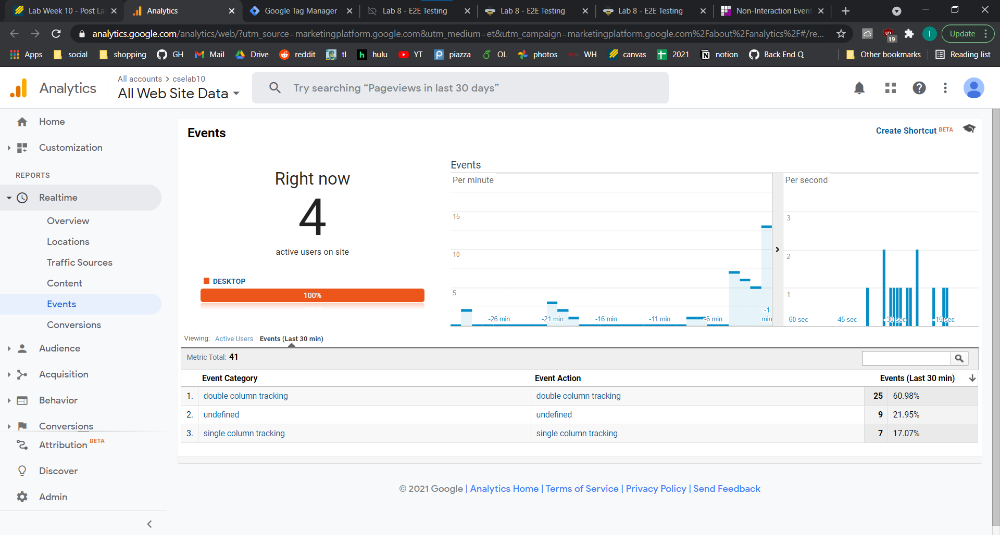

# Lab 10
## part 1
https://cse110-lab10-ivychxn.canny.io/
## part 2
for the first split: https://ivychxn.github.io/Lab10/index.html  
the second split should change the header background color
- when the flag is on, the header background color should be a light orange
- otherwise it should be a light lilac  
https://ivychxn.github.io/Lab10/secondSplit.html  
## part 3

